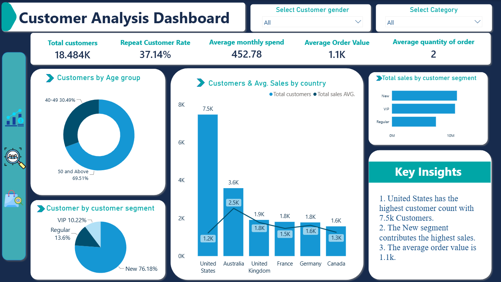
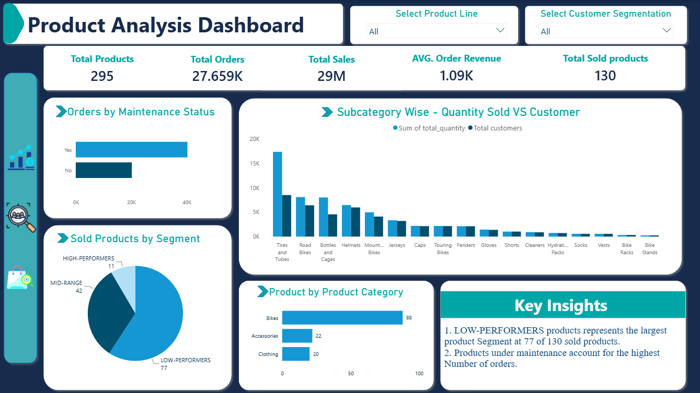

# SalesScope Analytics
#### Sales Performance , Customer Analysis and Products Insight Using SQL and Power BI

## Project Overview

This project focuses on analyzing sales data using SQL to identify business trends, evaluate sales performance, and generate meaningful insights and trends. It involves data exploration, data cleaning, and the development of customer and product reports to evaluate sales performance. It uses SQL to analyze sales data, track key performance indicators such as total revenue and order volume, and evaluate sales trends across products and time periods. A power BI dashboard is created to visualize key performance indicators and present the findings through interactive charts and visulizaation.

## Business Problem</h2>

The business needs to evaluate its sales performance to understand how revenue and order volumes change over time, which products contribute the most to overall sales, and where sales performance can be improved. Without a structured analysis, identifying sales trends and underperforming areas can be challenging.

## Tools & Technologies
- SQL
- Power BI (Dashboard Visualization)
- GitHub (Project Documentation)

## Key Analysis

- Exploratory Data Analysis (EDA)
- Customer Analysis
- Product Analysis
- Basic and Advanced SQL Queries
- Sales Performance Analysis

## Technical Skills Demonstrated

### SQL

- Data Exploration and Analysis
- Joins, Aggregations, and Subqueries
- Common Table Expressions (CTEs), including Nested CTEs
- Window Functions
- Date Functions
- Customer and Product Reporting

### Power BI

- SQL Server Data Connectivity
- Data Cleaning and Transformation using Power Query
- Data Modeling and Relationships
- DAX Measures and KPI Cards
- Interactive Slicers and Dynamic Filtering
- Data Visualization and Dashboard Design

## Dashboard Preview 
###        Sales Performance Dashboard

###        Customer Analysis Dashboard

###        Product Analysis Dashboard

📊 Key Insights

1. Sales Analysis

- Key findings related to overall sales performance and revenue trends.
- Analysis of sales patterns and order performance.

2. Customer Analysis

- Key findings related to customer purchasing behavior.
- Analysis of customer contributions to overall sales.

3. Product Analysis

- Key findings related to product sales and performance.
- Identification of top-performing products and product-level trends.

4. Dynamic Insights

- Implemented DAX measures to generate insights dynamically based on selected filters and slicers.
- Enabled interactive exploration of sales, customer, and product performance.

## Project Structure

- Scripts/ – SQL queries for data exploration, analysis, and reporting.
- Dashboard/ – Dashboard files and related resources.
- Screenshots/ – Dashboard screenshots for project preview.

🎯 Project Objective

To strengthen SQL data analysis skills and transform raw data into meaningful business insights through reporting and visualization.
